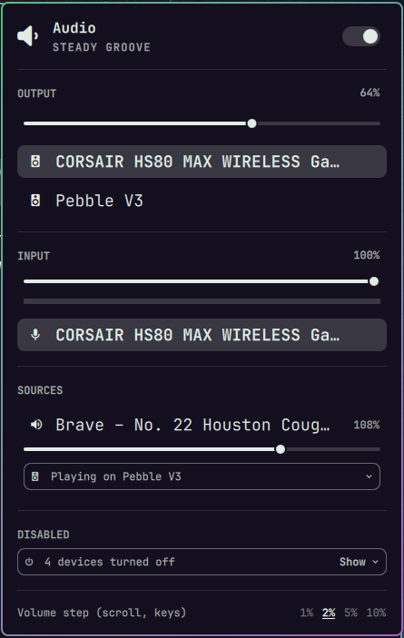
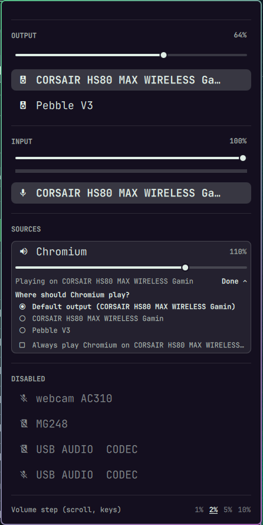
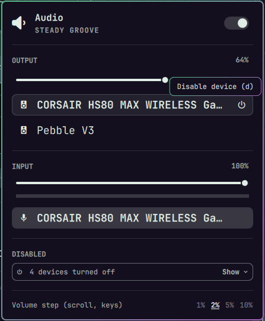

# omaudiopanel

Omarchy's audio panel, with the controls it was missing.

<p>
  
  
</p>

A drop-in replacement for the built-in `omarchy.audio` bar widget. Everything
the stock panel does still works the same way — volume, output and input
pickers, the per-app mixer, keyboard navigation — and it adds:

- **Disable devices.** Hover an output or input and click the power icon (or
  press `d`). Disabled devices collect in a **Disabled** section at the bottom,
  folded into one line ("4 devices turned off"). Click **Show** to list them,
  then click one to turn it back on. Nothing else is interrupted.

  

- **Choose where each app plays.** Under every app in the mixer, a
  "Playing on CORSAIR HS80" field shows its output. Click it to pick another
  (or press `r` to step through outputs).
- **Pin an app to an output.** In that picker, tick **Always play Brave on
  USB AUDIO CODEC** — the output you picked, or the one it is playing on. Every
  new Brave stream goes there. If the output disappears,
  Brave falls back to the default and moves back when the output returns.
- **Tell browser tabs apart.** Chromium-based browsers name every stream
  "Playback". When it can tell for certain, the mixer shows the tab instead:
  "Brave – Lions vs Bills Highlights". Otherwise it numbers them: "Brave · 1 of 2".
- **Pick the volume step.** 1%, 2%, 5% or 10% per scroll notch on the bar
  icon, per slider step and per `h`/`l` in the panel, set from the panel's
  footer.

Changing the default output also leaves apps you routed or pinned where they
are, instead of moving every stream to the new default.

## Install

```bash
omarchy plugin add https://github.com/thevideinfra/omaudiopanel.git --enable --yes
```

It declares itself a replacement for `omarchy.audio`, so `Super+Ctrl+A` and
other callers of the built-in panel open this one. Put it where the stock
widget was:

```bash
omarchy bar put videinfra.omaudiopanel --after omarchy.network
```

Needs Omarchy 4+, plus `pactl`, `pw-metadata` and `jq` (all present on a
standard install).

### Volume keys (optional)

The volume keys, and headset or keyboard volume wheels that send them, are
bound by Omarchy to a fixed 5%. To have them follow the panel's volume step,
add this to `~/.config/hypr/bindings.lua`:

```lua
local omaudiopanel = os.getenv("HOME") .. "/.config/omarchy/plugins/videinfra.omaudiopanel/bin/omaudiopanel"
hl.unbind("XF86AudioRaiseVolume")
hl.unbind("XF86AudioLowerVolume")
o.bind("XF86AudioRaiseVolume", "Volume up", omaudiopanel .. " volume up", { locked = true, repeating = true })
o.bind("XF86AudioLowerVolume", "Volume down", omaudiopanel .. " volume down", { locked = true, repeating = true })
```

## Settings

| Key          | Default | Meaning                                              |
|--------------|---------|------------------------------------------------------|
| `scrollStep` | `5`     | Volume step in percent (1–25). The footer sets it.   |

```bash
omarchy bar set videinfra.omaudiopanel scrollStep 2 --json
```

## How it works

The panel is the stock `Panel.qml` and `Model.js`, extended. The system side
lives in `bin/omaudiopanel`, a small script the panel calls:

- **Disabling** switches only that device's card profile — for example from
  `output:analog-stereo+input:mono-fallback` to `output:analog-stereo` to drop
  a headset's microphone, or to `off` when nothing is left. WirePlumber
  remembers the profile across reboots. No service is restarted.
- **Routing** sets `target.object` for the stream in PipeWire's default
  metadata. WirePlumber follows it, falls back to the default output when the
  target is missing, and relinks when it returns.
- **Pins** are kept in `~/.local/state/omaudiopanel/pins`. The panel applies
  them whenever a stream or output appears, whether or not it is open. Streams
  you route by hand are left alone.
- **Tab titles** come from the MPRIS players browsers publish per tab. A
  browser's streams all share one process, so a stream is matched to a tab only
  when that is certain: one stream and one player, or one playing stream and
  one playing player.

## Limits

- Turning off one side of a device that is in use (say, the microphone of the
  headset you are listening on) switches that device's profile, so its audio
  may glitch for a moment. Other devices are unaffected.
- Bluetooth profiles are not split into output and input parts, so disabling
  either side of a Bluetooth device turns it off.
- Routing covers playback. Recording apps are not listed, as in the stock panel.
- Games under Wine often open several unnamed streams ("audio stream #1",
  "#3"); they show as numbered rows, and a pin covers all of them.

## Development

```bash
npm test
```

Runs the `Model.js` unit tests with `node --test` and the helper tests, which
drive `bin/omaudiopanel` against stubbed `pactl` and `pw-metadata`.

The shell keeps a loaded plugin's QML cached; after editing, run
`omarchy restart shell` to see changes.
